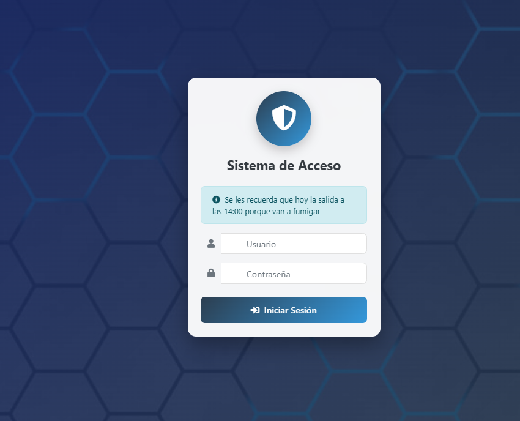
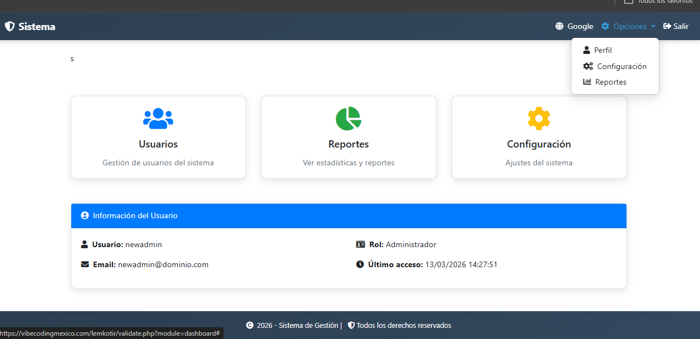
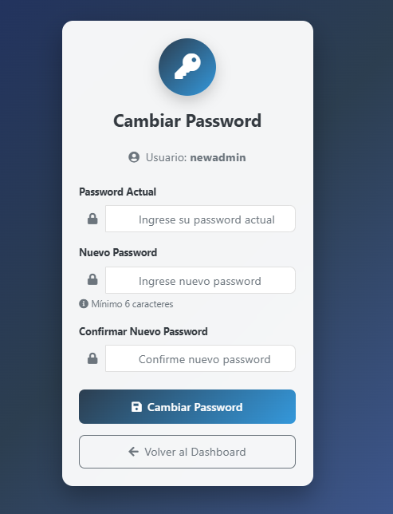
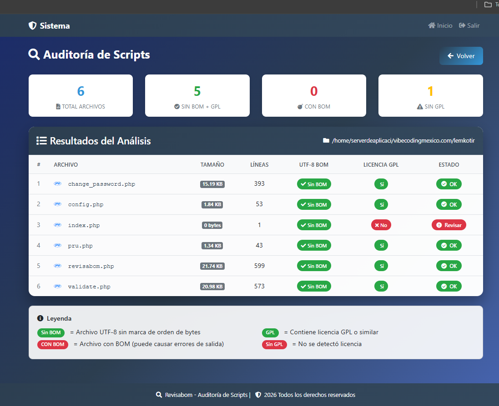
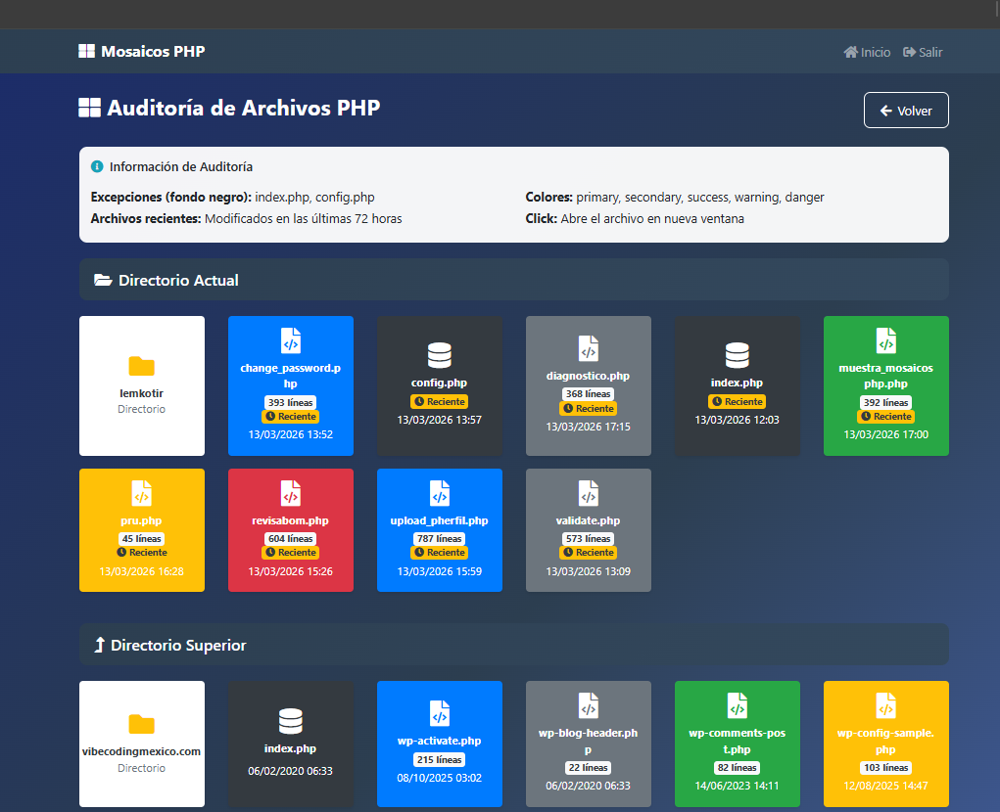
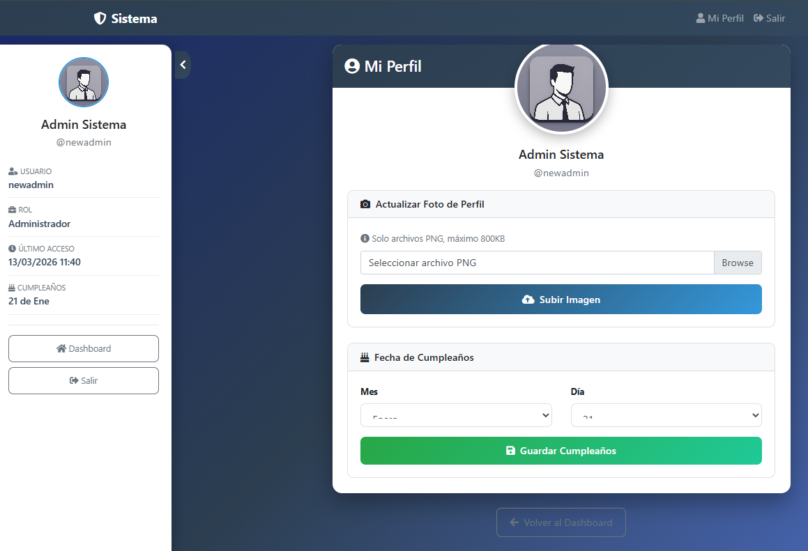
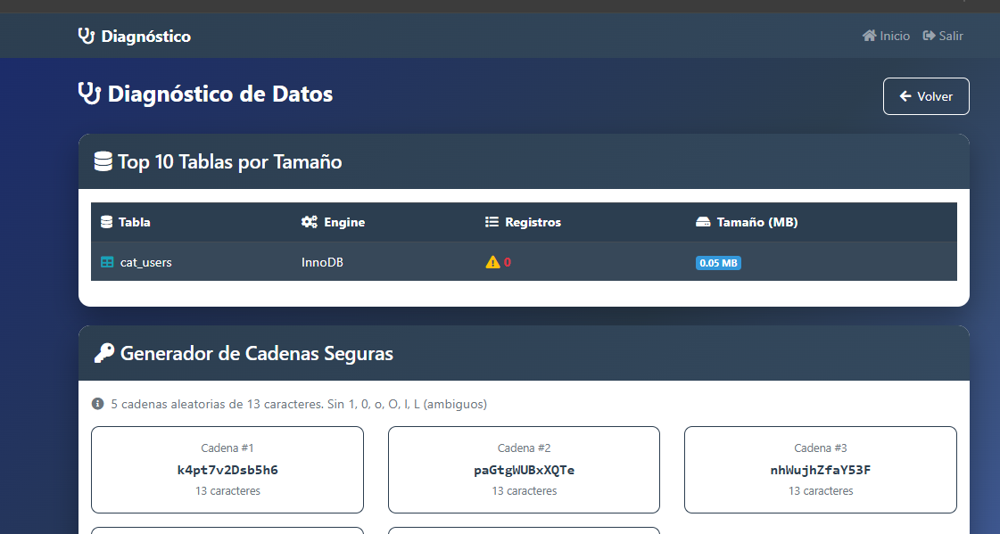
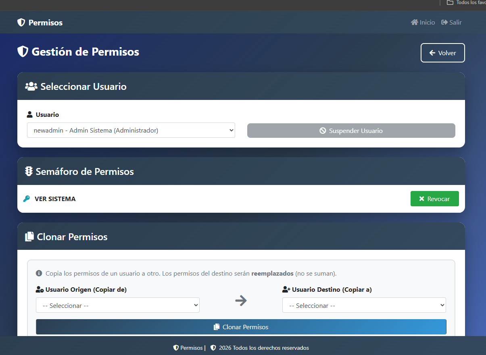
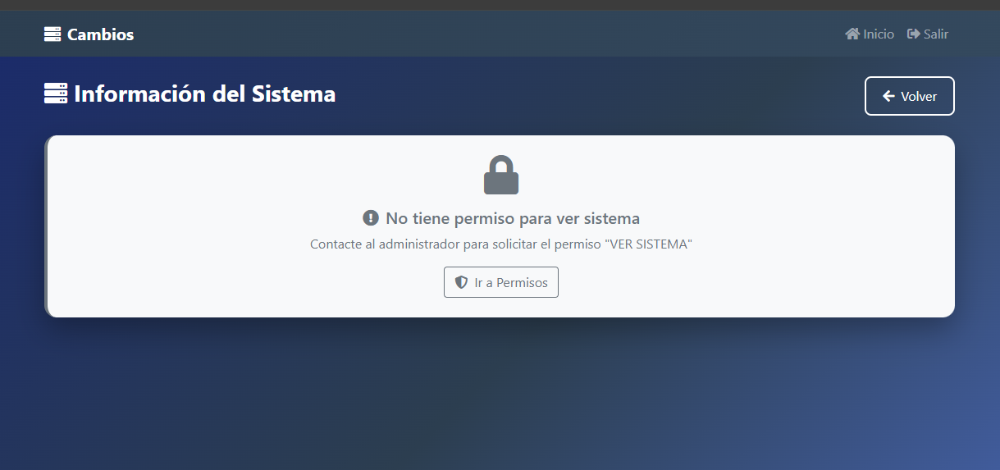
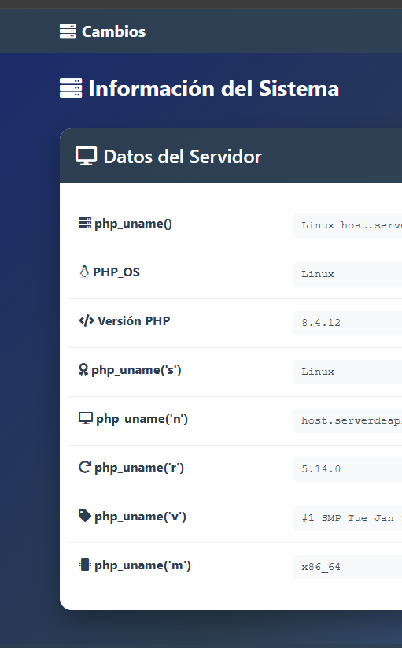

# 🚀 Proyecto Lemkotir (Laboratorio 1-1)

**Lemkotir** (palabra rúnica de Diablo II para atraer riqueza) es un sistema de **Rutinas Base para un Sistema de Gestión** en PHP. Este repositorio es el resultado de un experimento de **Vibe Coding** realizado en marzo de 2026, enfocado en la eficiencia para empresas medianas en LATAM.

La misión: Evaluar a **MiniMax-M2.5** como diseñador de interfaces profesionales, mientras el humano mantiene el control estricto de la seguridad y la arquitectura de datos. Se hicieron ajustes manuales y al momento no es 100% funcional. Mas informes en el sitio.

---

## ⚠️ Issues Actuales & Roadmap (Estado del Laboratorio)

Como parte de este experimento de co-programación, documentamos las fallas actuales para ser resueltas en futuras iteraciones:

* **change_password.php:** Actualmente la lógica de verificación de passwords presenta fallas en el script generado por MiniMax. Se requiere una revisión manual de la función `password_verify` y la estructura de los hashes.
* **upload_pherfil.php:** Actualmente no muestrael perfil por default.
* **Optimización de Archivos:** De momento, el sistema es "verbose" (un solo archivo por función). En la siguiente fase, comprimiremos la lógica en menos archivos para mejorar la mantenibilidad.
* **Prioridad Gráfica:** El enfoque actual es **100% estético y funcional en el frontend**. La depuración profunda de lógica de negocio se realizará una vez consolidada la interfaz de usuario.
* **Numero de bases** Tenemos pendiente verificar que reporte bien registros en tablas, en la parte de diagnostico. Se deja asi porque de momento solo hay una tabla.
* **Ajustar Colores** Mejorar loscolores de botones en permisos.php.

* **Todas las pruebasde celular se haranal terminar de unficar, no tiene caso trabajar dos veces** 

---

## 🛠️ Especificaciones Técnicas

* **Ambiente:** Optimizado para servidores cPanel y hospedajes compartidos (el estándar de la industria).
* **Versión de PHP:** Requiere **PHP 7.x o superior** (probado y optimizado en PHP 8.4).
* **Arquitectura:** Programación procedural, ligera y resiliente, ideal para redes inestables (como el metro de la CDMX).
* **Seguridad:** Migración de passwords legacy a **BCrypt**. Sistema de auditoría integrado para garantizar **"BOM Cero"**.

---

## 📂 Guía de Inicio Rápido

1.  **Base de Datos:** Ejecuta el script `database.sql`. Incluye un `DROP TABLE IF EXISTS` para una instalación limpia.
2.  **Credenciales Base:** * **Usuario:** `newadmin`
    * **Password:** `lemkotir*`
    * ⚠️ *Se sugiere cambiar la contraseña inmediatamente después del primer acceso.* Pueedeshacerlo en labase de datos en campo password
3.  **Configuración:** Crea tu archivo `config.php` basándote en la estructura centralizada de conexión `$link`.

---

## 📸 Galería del Laboratorio

### 1. Sistema de Acceso
Interfaz metálica con card flotante y fondo de hexágonos. Incluye área de avisos dinámicos.

### 2. Dashboard Principal (Estilo Metro)
Centro de control con mosaicos responsivos diseñados para operar con el pulgar en dispositivos móviles.

### 3. Gestión de Seguridad
Pantalla de cambio de password con validación de identidad y migración automática de hash.

### 4. Auditoría Técnica (Revisabom)
Monitor de salud del sistema. Verifica integridad de archivos, conteo de líneas y licencias GPL.

### 5. Mosaicos PHP (muestra_mosaicosphp)
Monitor de salud del sistema. permite ver archivos pgp con fechade modificacion.

### 6. Cambio Imagen Perfil (upload_pherfil)
Muestra la pantalla de cambio de imagen

### 7. Diagmostico y Password (diagnostico)
Muestra la pantalla de  basesde datos y genera passwords

### 8. Cambia Permisos (permisos)
Monitor de salud del sistema. permite ver archivos pgp con fechade modificacion.

### 9. Muestra Sistema PHP sin permiso (cambiap)
Prueba práctica de permisos

### 10. Muestra Sistema PHP con permiso (cambiap)
Prueba práctica de permisos

---

## 🧪 Notas del Autor (Bitácora de Vibe Coding)

Este proyecto forma parte de la serie de experimentos en **[vibecodingmexico.com](https://vibecodingmexico.com)**. Mi enfoque es la **Programación Real**: la que sobrevive a bloqueos de oficina y servidores compartidos.

Mi nombre es **Alfonso Orozco Aguilar**, mexicano, programador desde 1991. En 2026 compagino mi carrera como DevOps/Senior Dev con la licenciatura en Contaduría. 

**Hallazgo del experimento:** La IA (MiniMax) es una decoradora de interiores excepcional, pero un arquitecto distraído. Durante el desarrollo, intentó usar fallas de seguridad (como strings fijos 'MIGRADO' en campos de clave). La intervención humana corrigió esto a **NULL** para mantener la integridad de la DB.

---

## ⚖️ Licencia
Este proyecto se distribuye bajo la licencia **LGPL 2.1**. He elegido esta licencia para que el código sea una herramienta útil que puedas integrar en otros proyectos, permitiendo el uso de las rutinas base mientras se protege la integridad del núcleo.

---

## ✍️ Acerca del Autor
* **Sitio Web:** [vibecodingmexico.com](https://vibecodingmexico.com)
* **Facebook:** [Perfil de Alfonso Orozco Aguilar](https://www.facebook.com/alfonso.orozcoaguilar)
